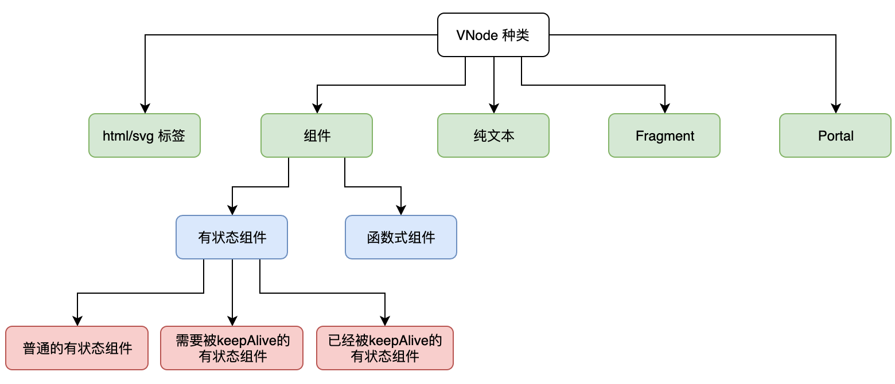

[title]: # (Vue渲染器)
[date]: # (2019-12-05 &nbsp; 22:35:53)
[categories]: # (VUE)
[description]: # (前方总有一条路,只是有时平坦,有时泥泞。)
[image]: # (https://i.loli.net/2020/04/01/PEpLVY64bvAurDq.jpg)

---

# 组件

## 模板引擎

模板引擎的概念是：模板字符串 + 数据 => html

在 JQuery 盛行的年代,模板引擎的概念流行

```js
import { template } from 'lodash'

const compiler = template('<h1><%= title %></h1>')
const html = compiler({ title: 'My Component' })

document.getElementById('app').innerHTML = html
```

我们将模板字符串传递给 template 函数,该函数返回一个编译器 compiler,只要把数据传入 compiler 函数,便能得到最终想要渲染的内容。

当数据发生变化时，我们需要使用新的数据重新编译模板：

```js
const newHtml = compiler({ title: 'New Component' })
```

## 模板引擎 ——> 组件

封装一下就得到了 组件！

```js
const MyComponent = props => {
  const compiler = MyComponent.cache || (MyComponent.cache = template('<h1><%= title %></h1>'))
  return compiler(props)
}
MyComponent.cache = null
```

使用

```js
document.getElementById('app').innerHTML = MyComponent({ title: 'MyComponent' })
```

## Virtual DOM

Vue 和 React： 模板字符串 + 数据 => Virtual DOM

借助 snabbdom 的 API , 使用 render 函数返回 Virtual DOM

```js
import { h } from 'snabbdom'

// h 函数用来创建 VNode，组件的产出是 VNode
const MyComponent = props => {
  return h('h1', props.title)
}
```

渲染真实DOM,模板引擎是的完全替换 html, 而虚拟DOM会替换部分,这个过程叫 patch

```js
import { h, init } from 'snabbdom'
// init 方法用来创建 patch 函数
const patch = init([])

const MyComponent = props => {
  // 函数式组件
  return h('h1', props.title)
}

// 组件的产出是 VNode
const prevVnode = MyComponent({ title: 'prev' })
// 将 VNode 渲染成真实 DOM
patch(document.getElementById('app'), prevVnode)
```

当数据变更时，组件会产出新的 VNode，我们只需再次调用 patch 函数即可：

```js
// 数据变更，产出新的 VNode
const nextVnode = MyComponent({ title: 'next' })
// 通过对比新旧 VNode，高效地渲染真实 DOM
patch(prevVnode, nextVnode)
```

为何组件要从直接产出 html 变成产出 Virtual DOM 呢？
其原因是 Virtual DOM 带来了 分层设计，它对渲染过程的抽象，使得框架可以渲染到 web(浏览器) 以外的平台，以及能够实现 SSR 等。

## VNode 渲染

```js
class MyComponent {
  // 有状态组件
  render() {
    // render 函数产出 VNode
    return {
      tag: 'div'
    }
  }
}
const elementVnode = {tag: 'div'}
const componentVnode = {tag: MyComponent}

function render(vnode, container) {
  if (typeof vnode.tag === 'string') {
    // html 标签
    mountElement(vnode, container)
  } else {
    // 组件
    mountComponent(vnode, container)
  }
}

// 根据 VNode 创建真实 DOM 并将其添加到容器中
function mountElement(vnode, container) {
  // 创建元素
  const el = document.createElement(vnode.tag)
  // 将元素添加到容器
  container.appendChild(el)
}

// 挂载组件
function mountComponent(vnode, container) {
  // 创建组件实例
  const instance = new vnode.tag()
  // 渲染
  instance.$vnode = instance.render()
  // 挂载
  mountElement(instance.$vnode, container)
}

// 把 elementVnode 渲染到 id 为 app 的元素下
render(elementVnode, document.getElementById('app'))
```

函数式组件：
 - 是一个纯函数
 - 没有自身状态，只接收外部数据
 - 产出 VNode 的方式：单纯的函数调用

有状态组件：
 - 是一个类，可实例化
 - 可以有自身状态
 - 产出 VNode 的方式：需要实例化，然后调用其 render 函数

---

 # VNode

## VNode 描述真实 DOM
一个 html 标签有它的名字、属性、事件、样式、子节点等诸多信息，这些内容都需要在 VNode 中体现

```js
const elementVNode = {
  tag: 'div',
  data: {
    style: {
      width: '100px',
      height: '100px',
      backgroundColor: 'red'
    }
  },
  children: {   // 子节点
    tag: 'span',
    data: null
  }
}
```

如果根元素并不是一个实实在在的真实 DOM，而是一个抽象的标识，即 Fragment 寓意是要渲染一个片段

```js
const Fragment = Symbol()
const fragmentVNode = {
  // tag 属性值是一个唯一标识
  tag: Fragment,
  data: null,
  children: [
    {
      tag: 'td',
      data: null
    },
    {
      tag: 'td',
      data: null
    },
    {
      tag: 'td',
      data: null
    }
  ]
}
```

Portal,它允许你把内容渲染到任何地方,不受 DOM 层级关系限制

## VNode 的种类

我们可以把 VNode 分成五类，分别是：html/svg 元素、组件、纯文本、Fragment 以及 Portal



如上图所示，我们可以把组件细分为 有状态组件 和 函数式组件。同时有状态组件还可以细分为三部分：普通的有状态组件、需要被 keepAlive 的有状态组件 以及 已经被 keepAlive 的有状态组件 。

但无论是普通的有状态组件还是 keepAlive 相关的有状态组件，它们都是有状态组件。所以我们在设计 VNode 时可以将它们作为一类看待。

## 枚举值 VNodeFlags

```js
const VNodeFlags = {
  // html 标签
  ELEMENT_HTML: 1,
  // SVG 标签
  ELEMENT_SVG: 1 << 1,

  // 普通有状态组件
  COMPONENT_STATEFUL_NORMAL: 1 << 2,
  // 需要被keepAlive的有状态组件
  COMPONENT_STATEFUL_SHOULD_KEEP_ALIVE: 1 << 3,
  // 已经被keepAlive的有状态组件
  COMPONENT_STATEFUL_KEPT_ALIVE: 1 << 4,
  // 函数式组件
  COMPONENT_FUNCTIONAL: 1 << 5,

  // 纯文本
  TEXT: 1 << 6,
  // Fragment
  FRAGMENT: 1 << 7,
  // Portal
  PORTAL: 1 << 8
}
```

```js
// html 和 svg 都是标签元素，可以用 ELEMENT 表示
VNodeFlags.ELEMENT = VNodeFlags.ELEMENT_HTML | VNodeFlags.ELEMENT_SVG
// 普通有状态组件、需要被keepAlive的有状态组件、已经被keepAlice的有状态组件 都是“有状态组件”，统一用 COMPONENT_STATEFUL 表示
VNodeFlags.COMPONENT_STATEFUL =
  VNodeFlags.COMPONENT_STATEFUL_NORMAL |
  VNodeFlags.COMPONENT_STATEFUL_SHOULD_KEEP_ALIVE |
  VNodeFlags.COMPONENT_STATEFUL_KEPT_ALIVE
// 有状态组件 和  函数式组件都是“组件”，用 COMPONENT 表示
VNodeFlags.COMPONENT = VNodeFlags.COMPONENT_STATEFUL | VNodeFlags.COMPONENT_FUNCTIONAL
```

```js
// html 元素节点
const htmlVnode = {
  flags: VNodeFlags.ELEMENT_HTML,
  tag: 'div',
  data: null
}

// svg 元素节点
const svgVnode = {
  flags: VNodeFlags.ELEMENT_SVG,
  tag: 'svg',
  data: null
}

// 函数式组件
const functionalComponentVnode = {
  flags: VNodeFlags.COMPONENT_FUNCTIONAL,
  tag: MyFunctionalComponent
}

// 普通的有状态组件
const normalComponentVnode = {
  flags: VNodeFlags.COMPONENT_STATEFUL_NORMAL,
  tag: MyStatefulComponent
}

// Fragment
const fragmentVnode = {
  flags: VNodeFlags.FRAGMENT,
  // 注意，由于 flags 的存在，我们已经不需要使用 tag 属性来存储唯一标识
  tag: null
}

// Portal
const portalVnode = {
  flags: VNodeFlags.PORTAL,
  // 注意，由于 flags 的存在，我们已经不需要使用 tag 属性来存储唯一标识，tag 属性用来存储 Portal 的 target
  tag: target
}
```

---

# h 函数

## 在VNode创建时确定其类型 - flags

```js
function h(tag, data = null, children = null) {
  let flags = null
  if (typeof tag === 'string') {
    flags = tag === 'svg' ? VNodeFlags.ELEMENT_SVG : VNodeFlags.ELEMENT_HTML
  } else if (tag === Fragment) {
    flags = VNodeFlags.FRAGMENT
  } else if (tag === Portal) {
    flags = VNodeFlags.PORTAL
    tag = data && data.target
  } else {
    // 兼容 Vue2 的对象式组件
    if (tag !== null && typeof tag === 'object') {
      flags = tag.functional
        ? VNodeFlags.COMPONENT_FUNCTIONAL       // 函数式组件
        : VNodeFlags.COMPONENT_STATEFUL_NORMAL  // 有状态组件
    } else if (typeof tag === 'function') {
      // Vue3 的类组件
      flags = tag.prototype && tag.prototype.render
        ? VNodeFlags.COMPONENT_STATEFUL_NORMAL  // 有状态组件
        : VNodeFlags.COMPONENT_FUNCTIONAL       // 函数式组件
    }
  }

  return {
    flags,
    // 其他属性...
  }
}
```

## 在VNode创建时确定其children的类型

```js
function h(tag, data = null, children = null) {
  // 省略用于确定 flags 相关的代码

  let childFlags = null
  if (Array.isArray(children)) {
    const { length } = children
    if (length === 0) {
      // 没有 children
      childFlags = ChildrenFlags.NO_CHILDREN
    } else if (length === 1) {
      // 单个子节点
      childFlags = ChildrenFlags.SINGLE_VNODE
      children = children[0]
    } else {
      // 多个子节点，且子节点使用key
      childFlags = ChildrenFlags.KEYED_VNODES
      children = normalizeVNodes(children)
    }
  } else if (children == null) {
    // 没有子节点
    childFlags = ChildrenFlags.NO_CHILDREN
  } else if (children._isVNode) {
    // 单个子节点
    childFlags = ChildrenFlags.SINGLE_VNODE
  } else {
    // 其他情况都作为文本节点处理，即单个子节点，会调用 createTextVNode 创建纯文本类型的 VNode
    childFlags = ChildrenFlags.SINGLE_VNODE
    children = createTextVNode(children + '')
  }
}
```

首先，如果 children 是数组，则根据数组的长度来判断 children 的类型到底是 ChildrenFlags.NO_CHILDREN、ChildrenFlags.SINGLE_VNODE 还是 ChildrenFlags.KEYED_VNODES。

这里大家可能会有疑问：“为什么多个子节点时会直接被当做使用了 key 的子节点？”，这是因为 key 是可以人为创造的，如下是 normalizeVNodes 函数的简化

如果 children 不满足以上任何条件，则会把 children 作为纯文本节点的文本内容处理

```js
function normalizeVNodes(children) {
  const newChildren = []
  // 遍历 children
  for (let i = 0; i < children.length; i++) {
    const child = children[i]
    if (child.key == null) {
      // 如果原来的 VNode 没有key，则使用竖线(|)与该VNode在数组中的索引拼接而成的字符串作为key
      child.key = '|' + i
    }
    newChildren.push(child)
  }
  // 返回新的children，此时 children 的类型就是 ChildrenFlags.KEYED_VNODES
  return newChildren
}

function normalizeVNodes(children) {
  const newChildren = []
  // 遍历 children
  for (let i = 0; i < children.length; i++) {
    const child = children[i]
    if (child.key == null) {
      // 如果原来的 VNode 没有key，则使用竖线(|)与该VNode在数组中的索引拼接而成的字符串作为key
      child.key = '|' + i
    }
    newChildren.push(child)
  }
  // 返回新的children，此时 children 的类型就是 ChildrenFlags.KEYED_VNODES
  return newChildren
}
```

例子：
假设有如下模板：
```html
<template>
  <div>
    <span></span>
  </div>
</template>

<template>
  <div>我是文本</div>
</template>

<template>
  <td></td>
  <td></td>
</template>

<template>
  <Portal target="#box">
    <h1></h1>
  </Portal>
</template>

<template>
  <MyFunctionalComponent>
    <div></div>
  </MyFunctionalComponent>
</template>
```

用 h 函数来创建与之相符的 VNode：
```js
import { h, Fragment, Portal } from './h'

const elementVNode = h('div', null, h('span'))

const elementWithTextVNode = h('div', null, '我是文本')

const fragmentVNode = h(Fragment, null, [
  h('td'), h('td')
])

const portalVNode = h(
  Portal,
  {
    target: '#box'
  },
  h('h1')
)

// 一个函数式组件
function MyFunctionalComponent() {}
// 传递给 h 函数的第一个参数就是组件函数本身
const functionalComponentVNode = h(MyFunctionalComponent, null, h('div'))
```

得到的 VNode 对象如下：
```js
const elementVNode = {
  _isVNode: true,
  flags: 1, // VNodeFlags.ELEMENT_HTML
  tag: 'div',
  data: null,
  children: {
    _isVNode: true,
    flags: 1, // VNodeFlags.ELEMENT_HTML
    tag: 'span',
    data: null,
    children: null,
    childFlags: 1, // ChildrenFlags.NO_CHILDREN
    el: null
  },
  childFlags: 2, // ChildrenFlags.SINGLE_VNODE
  el: null
}

const elementWithTextVNode = {
  _isVNode: true,
  flags: 1, // VNodeFlags.ELEMENT_HTML
  tag: 'div',
  data: null,
  children: {
    _isVNode: true,
    flags: 64,  // VNodeFlags.TEXT
    tag: null,
    data: null,
    children: '我是文本',
    childFlags: 1, // ChildrenFlags.NO_CHILDREN
    el: null
  },
  childFlags: 2, // ChildrenFlags.SINGLE_VNODE
  el: null
}

const fragmentVNode = {
  _isVNode: true,
  flags: 128, // VNodeFlags.FRAGMENT
  data: null,
  children: [
    {
      _isVNode: true,
      flags: 1, // VNodeFlags.ELEMENT_HTML
      tag: 'td',
      data: null,
      children: null,
      childFlags: 1,  // ChildrenFlags.NO_CHILDREN
      key: '|0', // 自动生成的 key
      el: null
    },
    {
      _isVNode: true,
      flags: 1, // VNodeFlags.ELEMENT_HTML
      tag: 'td',
      data: null,
      children: null,
      childFlags: 1,  // ChildrenFlags.NO_CHILDREN
      key: '|1', // 自动生成的 key
      el: null
    }
  ],
  childFlags: 4, // ChildrenFlags.KEYED_VNODES
  el: null
}

const portalVNode = {
  _isVNode: true,
  flags: 256, // VNodeFlags.PORTAL
  tag: '#box',  // 类型为 Portal 的 VNode，其 tag 属性值等于 data.target
  data: { target: '#box' },
  children: {
    _isVNode: true,
    flags: 1, // VNodeFlags.ELEMENT_HTML
    tag: 'h1',
    data: null,
    children: null,
    childFlags: 1, // ChildrenFlags.NO_CHILDREN
    el: null
  },
  childFlags: 2, // ChildrenFlags.SINGLE_VNODE
  el: null
}

const functionalComponentVNode = {
  _isVNode: true,
  flags: 32,  // VNodeFlags.COMPONENT_FUNCTIONAL
  tag: MyFunctionalComponent, // tag 属性值引用组件函数
  data: null,
  children: {
    _isVNode: true,
    flags: 1,
    tag: 'div',
    data: null,
    children: null,
    childFlags: 1,
    el: null
  },
  childFlags: 2, // ChildrenFlags.SINGLE_VNODE
  el: null
}
```


在设计有状态组件时，我们会设计一个基础组件，所有组件都会继承基础组件，并且基础组件拥有用来报告错误信息的 render 函数，这就是我们可以通过以下代码来区分函数式组件和有状态组件的原因：

```js
// Vue3 的类组件
flags =
  tag.prototype && tag.prototype.render
    ? VNodeFlags.COMPONENT_STATEFUL_NORMAL // 有状态组件
    : VNodeFlags.COMPONENT_FUNCTIONAL // 函数式组件

// 我们再来使用 h 函数创建有状态组件的 VNode，如下：
// 有状态组件应该继承 Component
class MyStatefulComponent extends Component {}
const statefulComponentVNode = h(MyStatefulComponent, null, h('div'))

// 此时我们得到的 VNode 对象如下：
const statefulComponentVNode = {
  _isVNode: true,
  flags: 4, // VNodeFlags.COMPONENT_STATEFUL_NORMAL
  data: null,
  children: {
    _isVNode: true,
    flags: 1,
    tag: 'div',
    data: null,
    children: null,
    childFlags: 1,
    el: null
  },
  childFlags: 2,
  el: null
}
```
